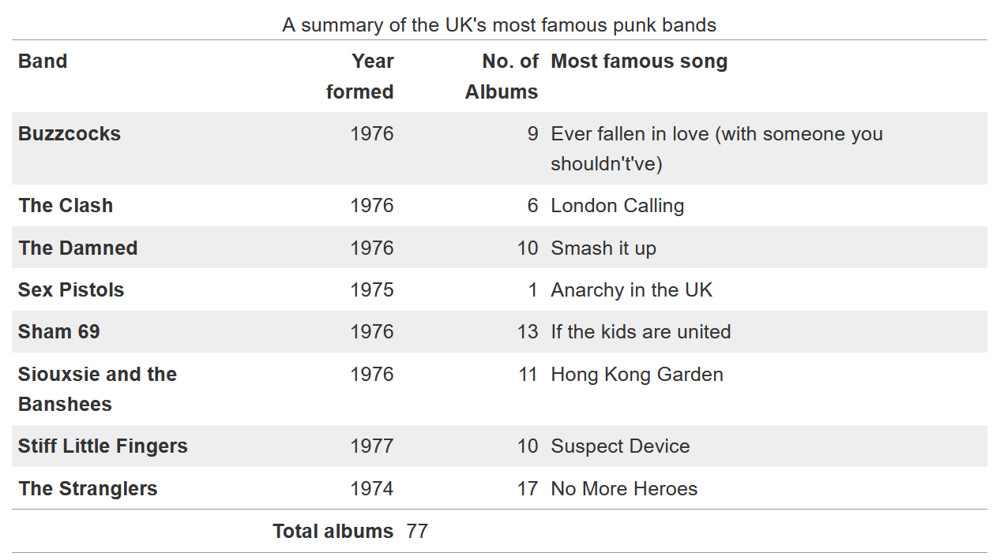

{{LearnSidebar}}

The aim of this skill test is to assess whether you understand how to [style HTML tables in CSS](/en-US/docs/Learn_web_development/Core/Styling_basics/Tables).

> [!NOTE]
> Click **"Play"** in the code blocks below to edit the examples in the MDN Playground.
> You can also copy the code (click the clipboard icon) and paste it into an online editor such as [CodePen](https://codepen.io/), [JSFiddle](https://jsfiddle.net/), or [Glitch](https://glitch.com/).
> If you get stuck, you can reach out to us in one of our [communication channels](/en-US/docs/MDN/Community/Communication_channels).

## Task

In the lesson on [styling tables](/en-US/docs/Learn_web_development/Core/Styling_basics/Tables), we styled up a table in a rather garish manner. In this task, we are going to style the same table, but using some good practices for table design as outlined in the external article [Web Typography: designing tables to be read not looked at](https://alistapart.com/article/web-typography-tables/).

Our finished table will look like the image below. There are a number of ways that you can achieve this, but we suggest you follow similar patterns as used in the tutorial to do the following things:

- Add padding of `0.3em` to the table headings and data and align them at the top of their cells.
- Align headings and data for columns containing numbers right.
- Align headings and data for columns containing text left.
- Align the heading of the table footer right.
- Align the data of the table footer left.
- Add a 1px top and bottom solid border with the hex color `#999` to the table.
- Add a 1px top solid border with the hex color `#999` to the footer.
- Remove the default spacing between the table elements borders to get the expected result.
- Stripe every odd row of the main table with the hex color `#eee`.



**Bonus question:** What can you do to make the table layout behave a bit more predictably? Think of how table columns are sized by default and how we can change this behavior to size the columns according to the width of their headings.

Try to update the code below to recreate the finished example:

```html live-sample___table
<table>
  <caption>
    A summary of the UK's most famous punk bands
  </caption>
  <thead>
    <tr>
      <th scope="col">Band</th>
      <th scope="col">Year formed</th>
      <th scope="col">No. of Albums</th>
      <th scope="col">Most famous song</th>
    </tr>
  </thead>
  <tbody>
    <tr>
      <th scope="row">Buzzcocks</th>
      <td>1976</td>
      <td>9</td>
      <td>Ever fallen in love (with someone you shouldn't've)</td>
    </tr>
    <tr>
      <th scope="row">The Clash</th>
      <td>1976</td>
      <td>6</td>
      <td>London Calling</td>
    </tr>
    <tr>
      <th scope="row">The Damned</th>
      <td>1976</td>
      <td>10</td>
      <td>Smash it up</td>
    </tr>
    <tr>
      <th scope="row">Sex Pistols</th>
      <td>1975</td>
      <td>1</td>
      <td>Anarchy in the UK</td>
    </tr>
    <tr>
      <th scope="row">Sham 69</th>
      <td>1976</td>
      <td>13</td>
      <td>If the kids are united</td>
    </tr>
    <tr>
      <th scope="row">Siouxsie and the Banshees</th>
      <td>1976</td>
      <td>11</td>
      <td>Hong Kong Garden</td>
    </tr>
    <tr>
      <th scope="row">Stiff Little Fingers</th>
      <td>1977</td>
      <td>10</td>
      <td>Suspect Device</td>
    </tr>
    <tr>
      <th scope="row">The Stranglers</th>
      <td>1974</td>
      <td>17</td>
      <td>No More Heroes</td>
    </tr>
  </tbody>
  <tfoot>
    <tr>
      <th colspan="2" scope="row">Total albums</th>
      <td colspan="2">77</td>
    </tr>
  </tfoot>
</table>
```

```css hidden live-sample___table
body {
  padding: 1em;
  font: 1.2em / 1.5 sans-serif;
  font-size: 80%;
}
```

```css live-sample___table
/* Add styles here */
```

{{EmbedLiveSample("table", "", "400px")}}

<details>
<summary>Click here to show the solution</summary>

The below is a sample of how the end result could be achieved, using similar techniques to the lesson. However there are a number of ways that would be perfectly correct, perhaps slightly more verbose.

```css
table {
  border-top: 1px solid #999;
  border-bottom: 1px solid #999;
  border-collapse: collapse;
}

th,
td {
  vertical-align: top;
  padding: 0.3em;
}

tr :nth-child(2),
tr :nth-child(3) {
  text-align: right;
}

tr :nth-child(1),
tr :nth-child(4) {
  text-align: left;
}

tbody tr:nth-child(odd) {
  background-color: #eee;
}

tfoot {
  border-top: 1px solid #999;
}

tfoot tr :nth-child(1) {
  text-align: right;
}

tfoot tr :nth-child(2) {
  text-align: left;
}
```

For the bonus question, you can make the table layout more predictable by adding {{cssxref("table-layout")}} with a value of [`fixed`](/en-US/docs/Web/CSS/table-layout#fixed) and an explicit `width`:

```css
table {
  table-layout: fixed;
  width: 100%;
}
```

</details>

## See also

- [CSS building blocks](/en-US/docs/Learn/CSS/Building_blocks)
- [Web Typography: Designing Tables to be Read, Not Looked At](https://alistapart.com/article/web-typography-tables) on alistapart.com (2017)
