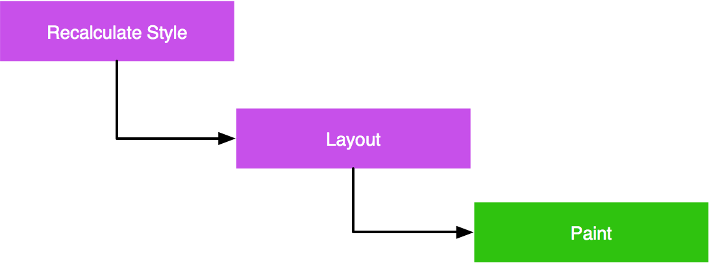

{{QuickLinksWithSubPages("Web/Performance")}}

Animation on the web can be done via {{domxref('SVGAnimationElement', 'SVG')}}, {{domxref('window.requestAnimationFrame','JavaScript')}}, including {{htmlelement('canvas')}} and {{domxref('WebGL_API', 'WebGL')}}, CSS {{cssxref('animation')}}, {{htmlelement('video')}}, animated GIFs and even animated PNGs and other image types. The performance cost of animating a CSS property can vary from one property to another, and animating expensive CSS properties can result in {{glossary('jank')}} as the browser struggles to hit a smooth {{glossary("FPS", "frame rate")}}.

For animated media, such as video and animated GIFs, the main performance concern is file size - downloading the file fast enough to not negatively impact performance is the greatest issue. Code based animations, be it CSS, SVG, \<canvas>, WebGL or other JavaScript animations, can cause performance issues even if the bandwidth footprint is small. These animations can consume CPU and/or cause jank.

Users expect all interface interactions to be smooth and all user interfaces to be responsive. Animation can help make a site feel faster and responsive, but animations can also make a site feel slower and janky if not done correctly. Responsive user interfaces have a frame rate of 60 frames per second (fps). While it is not always possible to maintain 60fps, it is important to maintain a high and steady frame rate for all animations.

With [CSS animations](/en-US/docs/Web/CSS/CSS_animations/Using_CSS_animations) you specify a number of [keyframes](/en-US/docs/Web/CSS/@keyframes), each of which uses CSS to define the appearance of the element at a particular stage of the animation. The browser creates the animation as a transition from each keyframe to the next.

Compared with animating elements using JavaScript, CSS animations can be easier to create. They can also give better performance, as they give the browser more control over when to render frames, and to drop frames if necessary.

However, the performance cost of modifying a CSS property can vary from one property to another. It's commonly accepted that 60 frames per second is the rate at which animations will appear smooth. For a rate of 60 frames per second, the browser has 16.7 milliseconds to execute scripts, recalculate styles and layout if needed, and repaint the area being updated. Slow scripts and animating expensive CSS properties can result in [jank](/en-US/docs/Glossary/Jank) as the browser struggles to hit a smooth frame rate.

## The rendering waterfall

The process a browser uses to paint changes to a page when an element is animating CSS properties can be described as a waterfall consisting of the following steps:

1. **Recalculate Style**: when a property for an element changes, the browser must recalculate computed styles.
2. **Layout**: next, the browser uses the computed styles to figure out the position and geometry for the elements. This operation is labeled "layout" but is also sometimes called "reflow".
3. **Paint**: finally, the browser needs to repaint the elements to the screen. One last step is not shown in this sequence: the page may be split into layers, which are painted independently and then combined in a process called "Composition".

This sequence needs to fit into a single frame, since the screen isn't updated until it is complete.

## CSS property cost

In the context of the rendering waterfall, some properties are more expensive than others:

- Properties that affect an element's **geometry** or **position** trigger a:

  - style recalculation
  - layout
  - repaint

  For example: {{cssxref("left")}}, {{cssxref("max-width")}}, {{cssxref("border-width")}}, {{cssxref("margin-left")}}, {{cssxref("font-size")}}

- Properties that do _not_ affect geometry or position and are _not rendered_ in their own layer, do _not_ trigger a layout. They do trigger a:

  - style recalculation
  - repaint

  For example: {{cssxref("color")}}

- Properties that _are rendered_ in their **own layer** don't even trigger a repaint, because the update is handled in **composition**. These do trigger:

  - style recalculation

  For example: {{cssxref("transform")}}, {{cssxref("opacity")}}

## Developer tools

Most web browsers include tools to provide insight into the work the browser is doing when it animates elements of a page. Using these tools you can measure an application's animation frame rate, and diagnose performance bottlenecks if any are found.

- [Chrome performance tools](https://developer.chrome.com/docs/devtools/#performance)
- [Firefox performance tools](https://firefox-source-docs.mozilla.org/devtools-user/performance/)
